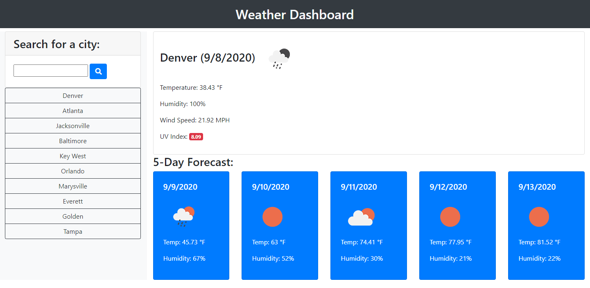

# Weather Dashboard

## Page Description
This page provides a weather dashboard for a user.  The user can search for a city with the form. The current date is displayed with the moment API. The Open Weather Map APIs are used to retrieve the current conditions: weather conditions, temperature, humidity, wind speed, and UV index; and a 5 day forecast for the city. The most recent 10 searches are retained in local storage and populated on a list below the search form.  Clicking on a recent search will bring up the latest result for that city and move the city to the top of the recent searches list.  API errors are captured and displayed in a user friendly format before reloading the page to try another search.

## Tools Used
JavaScript
jQuery
Bootstrap
moment
Open Weather Map
HTML
CSS

## Page Link
The page is hosted at https://kpehl.github.io/weather-dashboard/ 

## Screenshot
